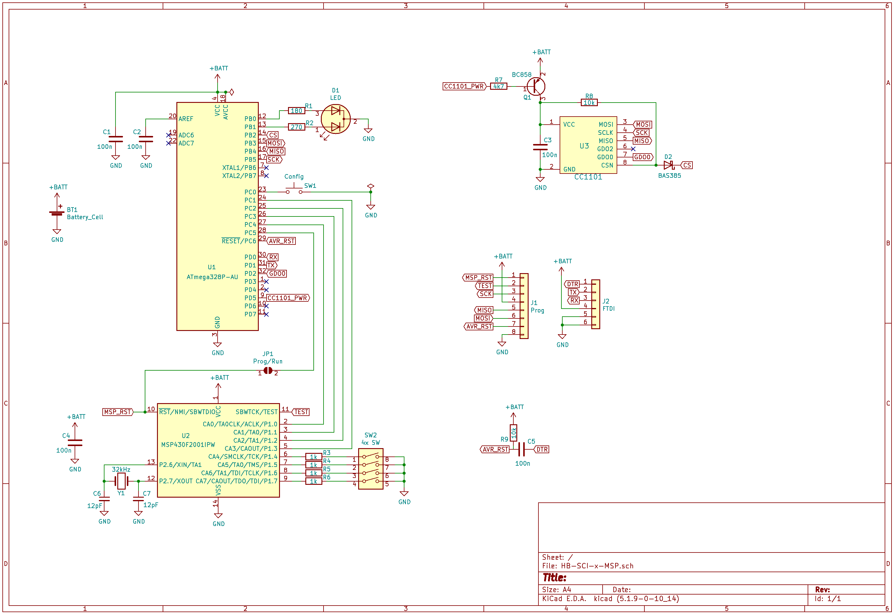
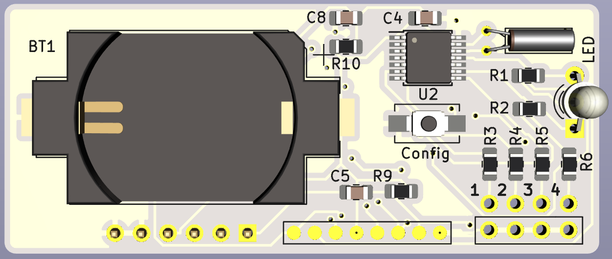
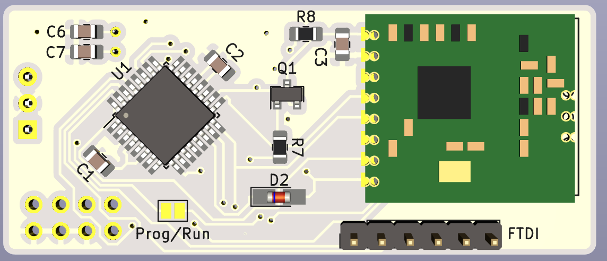

# HB-SCI-x-MSP

Ultra-Low-Power 1...4-fach Schließerkontakt-Interface _(basiert auf HM-SCI-3-FM mit MSP430(F2001) Kontaktüberwachung)_.

- Code für den MSP430: [msp430.c](https://github.com/jp112sdl/HB-SCI-x-MSP/blob/master/TI_MSP430/msp430.c)
- Code für den AVR: [MSP430State.h](https://github.com/jp112sdl/HB-SCI-x-MSP/blob/master/MSP430State.h) und [HB-SCI-x-MSP.ino](https://github.com/jp112sdl/HB-SCI-x-MSP/blob/master/HB-SCI-x-MSP.ino)
  - benötigte Libs: 
    - [Low-Power](https://github.com/rocketscream/Low-Power/)
    - [EnableInterrupt](https://github.com/GreyGnome/EnableInterrupt/)
    - [AskSinPP](https://github.com/pa-pa/AskSinPP)

#### Schaltplan

#### Platine (57x24mm)

